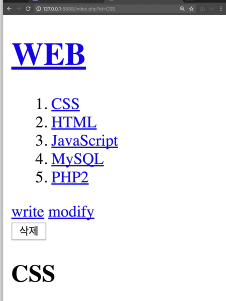

# PHP CRUD Project

- php를 통해서 간단하게 웹 에서 CRUD 를 구성한다
- 여러 사람이 접근하였을때 글을쓰고, 수정, 삭제가 가능해야한다.
- 완성 예상본은 아래와 같다.



### POST VS GET

- form.html 을 아래와 같이 작성한다

```html
<!DOCTYPE html>
<html lang="en">
  <head>
    <meta charset="UTF-8" />
    <meta name="viewport" content="width=device-width, initial-scale=1.0" />
    <title>Document</title>
  </head>
  <body>
    <form action="form.php">
      <p><input type="text" name="title" placeholder="Title" /></p>
      <p><textarea name="description"></textarea></p>
      <p>
        <input type="submit" />
      </p>
    </form>
  </body>
</html>
```

- form.php에서 html의 데이터를 자동으로 저장해주는 코드를 작성한다.

```php
<?php
file_put_contents('data/'.$_GET['title'], $_GET['description'])
?>
```

- 이중 html 의 input 태그에 method = post 로 설정할 경우 title,description값을 url에 나타내지 않고 데이터를 전달한다.
- 설정을 안하거나 method=get 방식으로 전달할 경우 title,description 값을 url에 담아서 데이터를 전달한다.
-
